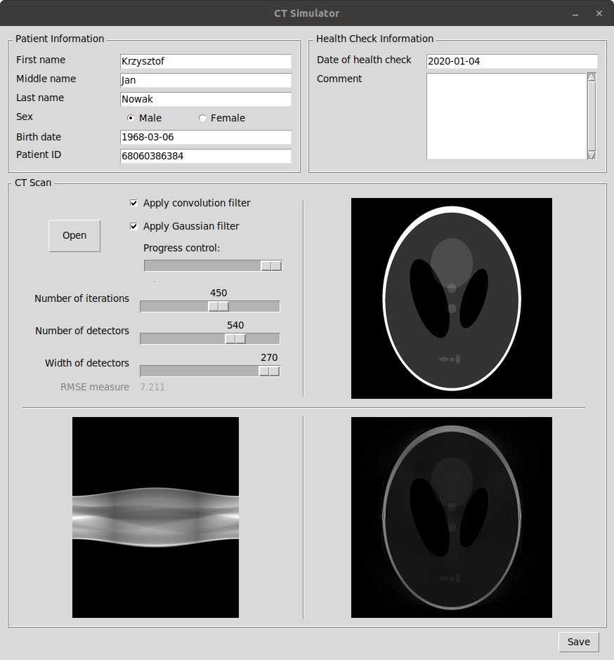
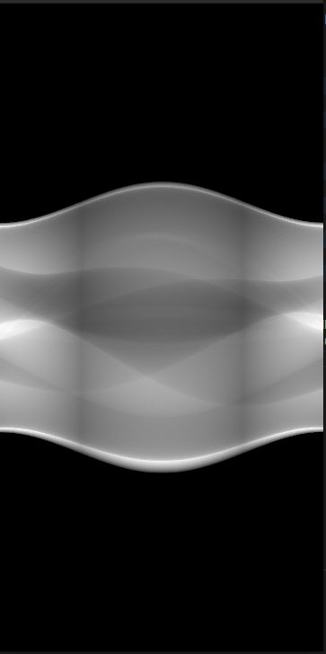
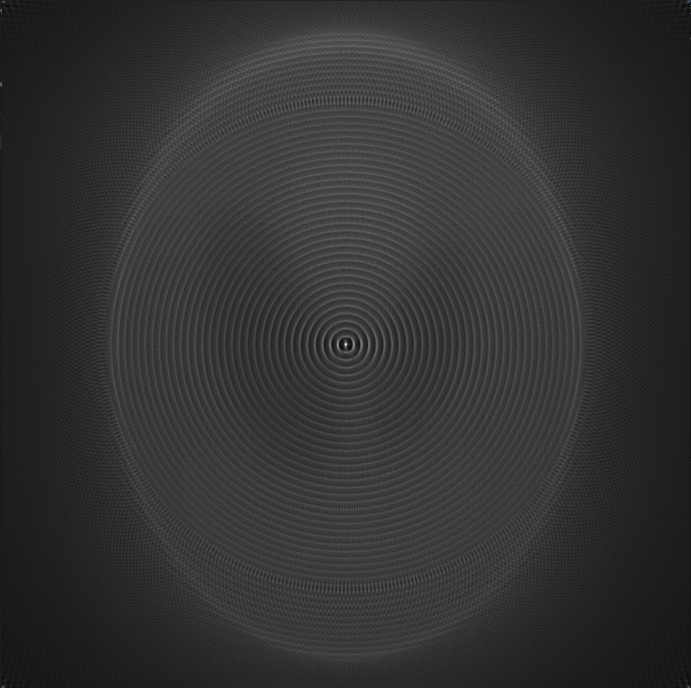
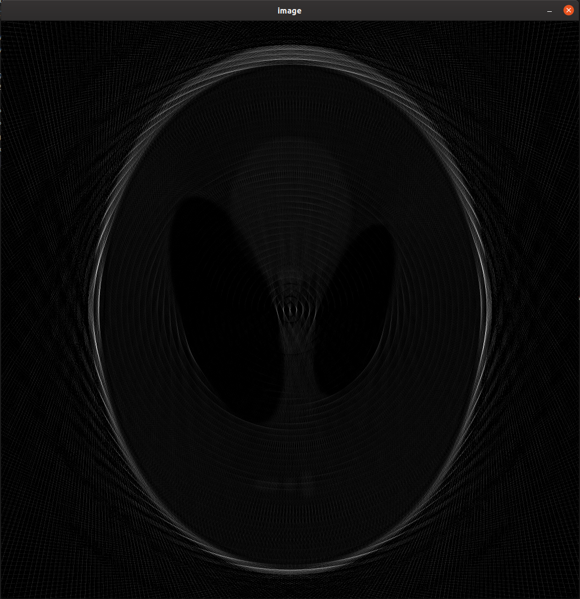
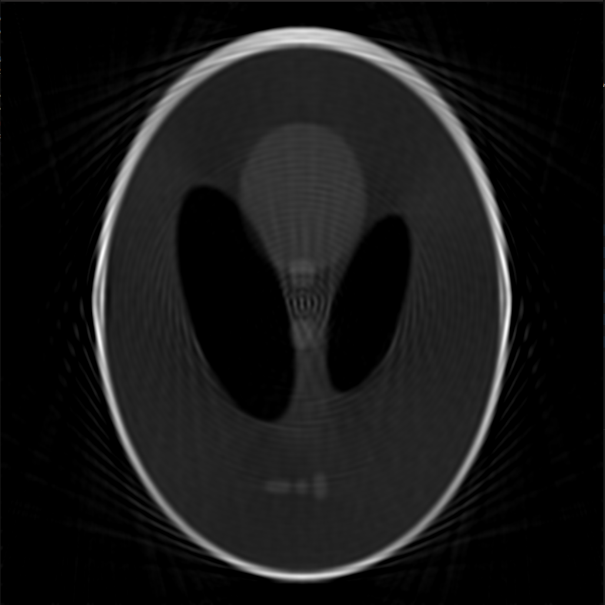
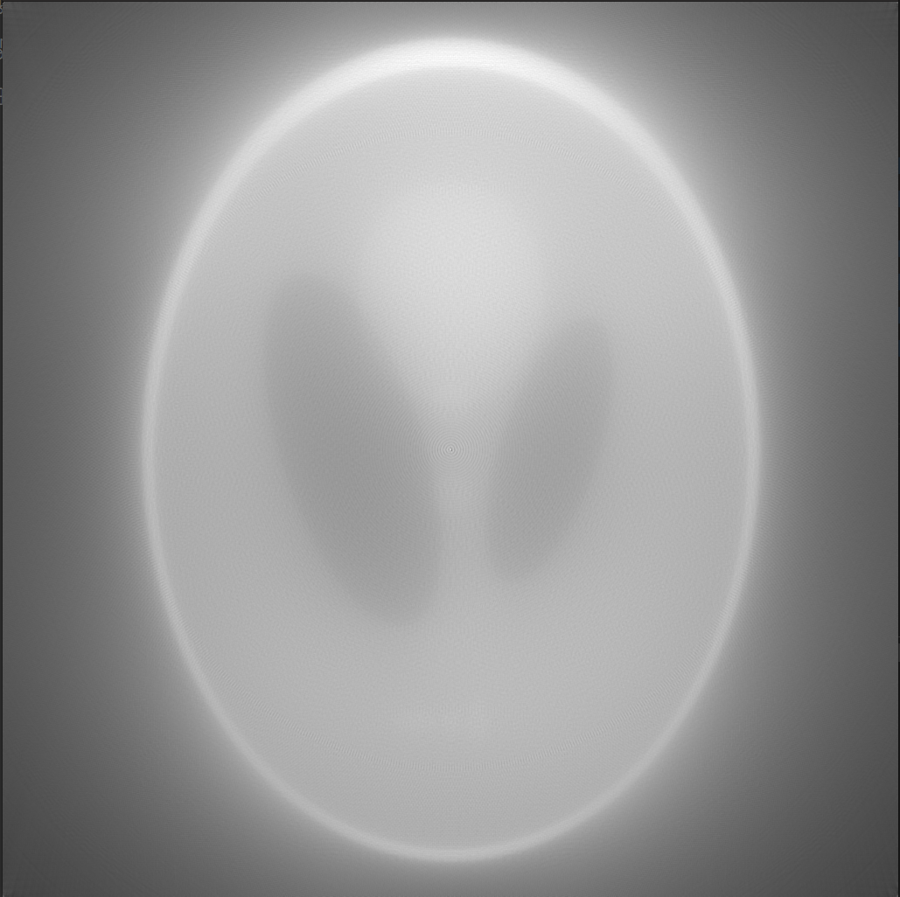
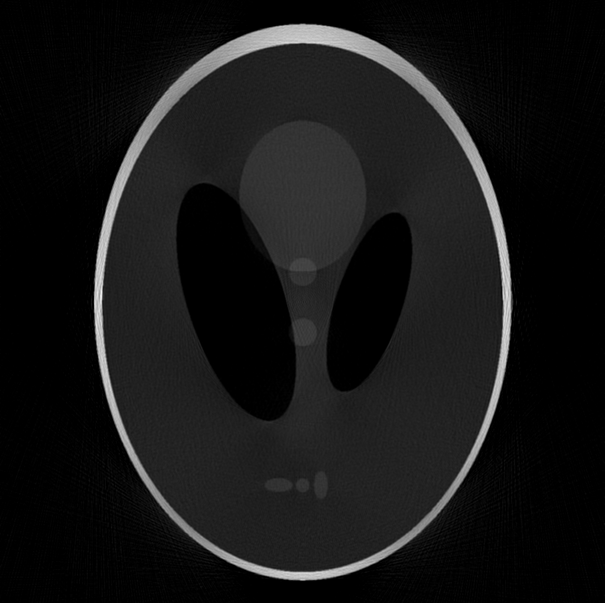
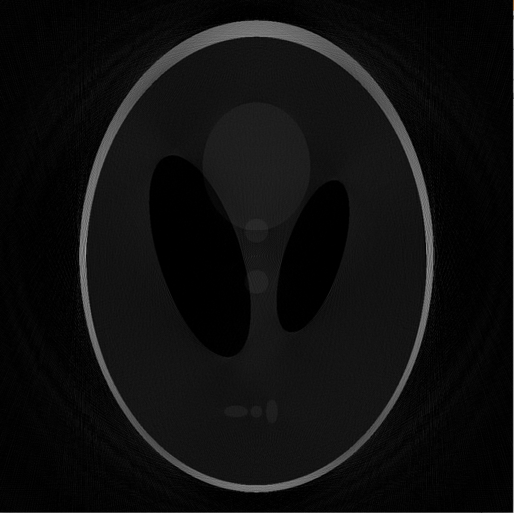

# IwM-Project_1-CT-Simulator

transformacja Radona(360 iteracji, 720 detektorów i emiterów )

transformacja odwrotna Radona z filtrem gaussa(200 iteracji, 200 detektorów i emiterów )

transformacja odwrotna Radona z filtrem i bez filtra gaussa(200 iteracji, 200 detektorów i emiterów )

transformacja odwrotna Radona z filtrem i z filtrem gaussa(200 iteracji, 200 detektorów i emiterów )

transformacja odwrotna Radona z filtrem gaussa(360 iteracji, 720 detektorów i emiterów )

transformacja odwrotna Radona z filtrem i bez filtra gaussa(360 iteracji, 720 detektorów i emiterów )

transformacja odwrotna Radona z filtrem i z filtrem gaussa(360 iteracji, 720 detektorów i emiterów )

